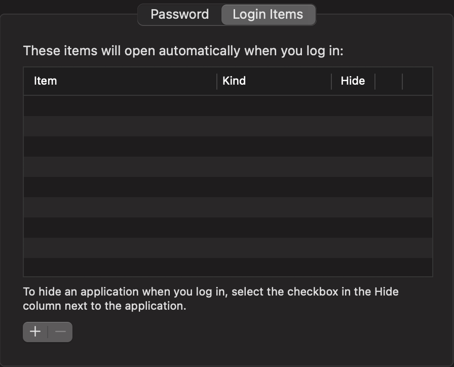

I generally don't like when a program does something I explicitly told it not to do. I'm a little crazy that way I suppose. I especially don't like when that thing I told it not to do is starting itself up apropos of nothing. In fact, I dislike this behavior so much, I have exactly zero applications configured to launch when my computer starts.



So, imagine my surprise when - despite unchecking its little "Open at Login" checkmark - the Spotify app for MacOS opens itself right up on login. My first attempt was to just go into the launch items configuration myself per [Apple's documentation](https://support.apple.com/guide/terminal/script-management-with-launchd-apdc6c1077b-5d5d-4d35-9c19-60f2397b2369/mac):

```
cd /Library/LaunchDaemons
cd /Library/LaunchAgents
cd ~/Library/LaunchAgents
```

And remove any offenders, when:

```
ls -a
.   ..
```

There was nothing there either! Luckily, MacOS has a centralized command for this, right? Let's take a look using `launchctl`

```
launchctl list | grep spotify
-	0	com.spotify.client.startuphelper
```

Great, we'll just remove this sucker and be on our way.

```
launchctl remove com.spotify.client.startuphelper
```

Let's restart and make sure we don't have any nasty-


Motherfu-, come on! We literally just removed this! This is gonna require some more work than it should. We dive into Spotify's little slice of hell in our system

```
cd /Applications/Spotify.app/Contents
ls Library/LoginItems 
StartUpHelper.app
```

And we see the devil himself, right there named `StartUpHelper` and everything. Now, we could just delete this

```
rm -rf /Applications/Spotify.app/Contents/Library/LoginItems/StartUpHelper.app
```

as a simple way to be done with it (and I did, and didn't see any issues), but this time I opted for a subtler creature

```
cd /Applications/Spotify.app/Contents/Library/LoginItems/StartUpHelper.app/Contents/MacOS
chmod -x StartUpHelper
```

which just removes the executable flag from this wretched, dreadful little app. After all, we aren't barbarians are we? What is the need for violence, for obliteration, when a simple neutralization will do? Upon restart, I am - finally - no longer seeing Spotify on launch anymore.