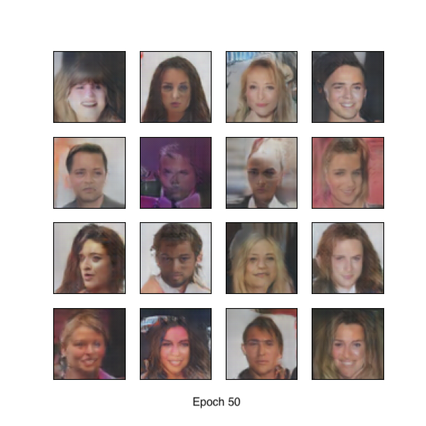
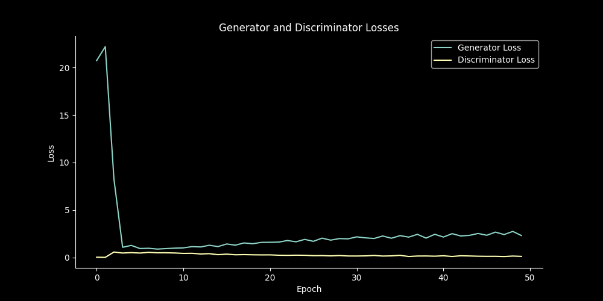
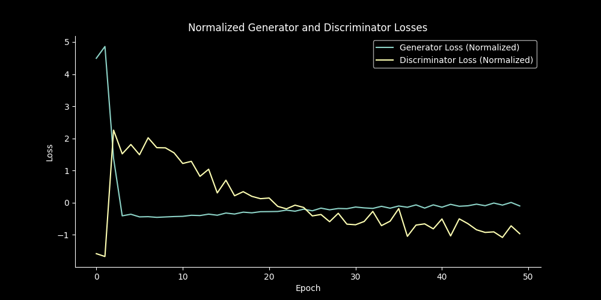
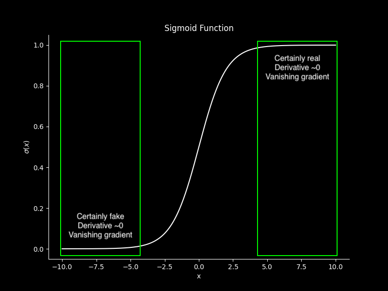
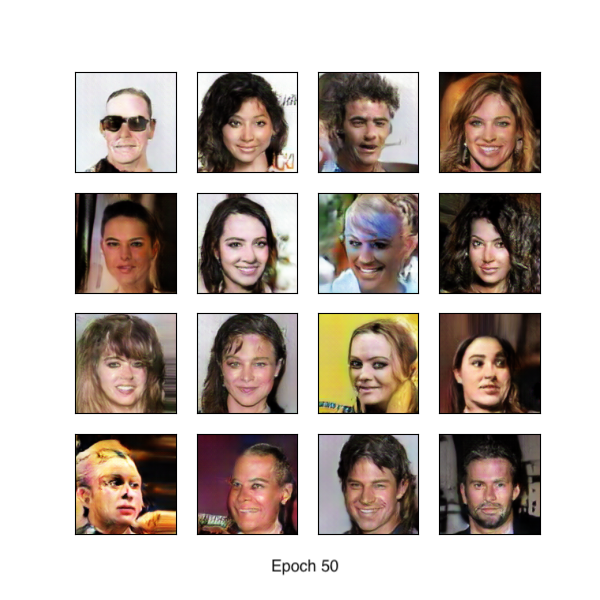
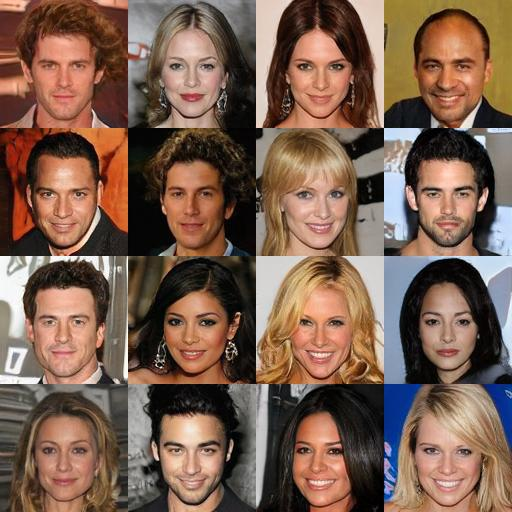

My first foray into generative models begins with generative adversarial models (or **GANs**). Introduced in 2014 by Ian Goodfellow et al. [^1], GANs quickly gained popularity for their ability to generate high quality, diverse, high-dimensional data samples. As you will soon see, however, the emphasis here is very much on "ability to," and not "tendency to," for GANs are notoriously sensitive to hyperparameters, often become unstable during training due to their adversarial nature, and are prone to vanishing gradients. Luckily, the generative capability of these models inspired an equally impressive volume of research and experimentation on how to mitigate these challenges and improve the performance of GANs for some truly amazing results.

## GAN Overview

GANs are composed of two models: the generator model and the discriminator model. The generator *generates* samples from the underlying distribution of the training data, while the discriminator *discriminates* between real samples from the training data and fake samples produced by the generator. The basic idea is to train the two models simultaneously, so that both improve together at similar rates. The training is adversarial because the generator's goal is to fool the discriminator with convincing fake samples, while the discriminator's goal is to determine which samples are from the data and which are generated. Ian Goodfellow uses the following analogy:

> The generative model can be thought of as analogous to a team of counterfeiters, trying to produce fake currency and use it without detection, while the discriminative model is analogous to the police, trying to detect the counterfeit currency. Competition in this game drives both teams to improve their methods until the counterfeits are indistiguishable from the genuine articles.

Training for the overall GAN is therefore framed as a "game" between the generator and the discriminator. The generator's objective is to minimize the discriminator's score (by fooling it) and the discriminator's objective is maximize its probability of correctly classifying the real and fake data. Assuming a class label of 1 for real data and 0 for fake data, the value function is

$$
\underset{G}{\min}\underset{D}{\max} \mathbb{E}_{x \sim p_{X}}[\log D(x)] + \mathbb{E}_{z \sim p_{Z}}[\log (1 - D(G(z)))]
$$

where $p_{X}$ is the probability distribution of the training data and $p_{Z}$ is the probability distribution of the latent space (usually the uniform distribution). Walking through this, the value function is maximal when $D(x) = 1$ (because $\log D(x) = \log 1 = 0$) and $D(G(z)) = 0$ and it is minimal when $D(G(z)) = 1$ (because $\log (1 - D(G(z))) = -\infty$). So you can see the adversarial relationship is reflected here. In terms of training, the basic formulation is

```python
for real_images in data:
    z = get_noise_vector()
    fake_images = generator(z)
    fake_predictions = discriminator(fake_images)
    real_predictions = discriminator(real_images)
    loss_d = BCELoss(fake_predictions, 0) + BCELoss(real_predictions, 1)
    loss_g = BCELoss(fake_predictions, 1)
```

I did not actually implement the original GAN architecture using fully-connected layers from this paper since, by the time of writing this, several iterations of improvements are already standard and produce much better results.

## DCGAN

**Training time**: A few hours

The deep convolutional GAN (**DCGAN**) is where I actually started my experiments. This architecture was first introduced in 2015 [^2] and the key insight here was to use only convolutional layers and batch normalization, without any fully connected or static pooling layers. The intelligent use of convolutions proposed allows the model to better capture spatial information from the data, which it can use to generate more realistic images. Batch normalization helps to stabilize the generator and discriminator networks by reducing the internal covariate shift: the shift in the distribution of neuron activations during training. I also normalized and center-cropped the dataset as part of pre-processing which helps create more uniform contours in the cost function space and thus leads to faster and more stable convergence. With the exception of the number of feature maps, I used the same hyperparameters recommended by the paper authors.

| Hyperparameter             | Value  |
|----------------------------|--------|
| Learning rate $\alpha$     | 0.0002 |
| Batch size                 | 128    |
| LeakyReLU slope            | 0.2    |
| Momentum $\beta_{1}$       | 0.5    |
| $Z$ dimension              | 100    |
| Convolutional layers       | 4      |
| Generator feature maps     | 100    |
| Discriminator feature maps | 100    |
| Image size                 | 64     |

For all experiments here (except [ShellGAN](#shellgan)), I used the [CelebA](https://mmlab.ie.cuhk.edu.hk/projects/CelebA.html) dataset: 200k 178 x 218 pixels images of celebrities. The full dataset is labelled, but I did not use them. As mentioned above, I used the implementation described by the paper authors for this, which you can view below.

```python
generator = nn.Sequential(
    # Conv 1
    nn.ConvTranspose2d(z_dim, ngf * 8, 4, 1, 0, bias=False),
    nn.BatchNorm2d(ngf * 8),
    nn.ReLU(inplace = True),
    # Conv 2
    nn.ConvTranspose2d(ngf * 8, ngf * 4, 4, 2, 1, bias=False),
    nn.BatchNorm2d(ngf * 4),
    nn.ReLU(inplace = True),
    # Conv 3
    nn.ConvTranspose2d(ngf * 4, ngf * 2, 4, 2, 1, bias=False),
    nn.BatchNorm2d(ngf * 2),
    nn.ReLU(inplace = True),
    # Conv 4
    nn.ConvTranspose2d(ngf * 2, ngf, 4, 2, 1, bias=False),
    nn.BatchNorm2d(ngf),
    nn.ReLU(inplace = True),
    # Conv 5
    nn.ConvTranspose2d(ngf, IM_CHAN, 4, 2, 1, bias=False),
    nn.Tanh()
)
discriminator = nn.Sequential(
    # Conv 1
    nn.Conv2d(IM_CHAN, ndf, 4, 2, 1),
    nn.BatchNorm2d(ndf),
    nn.LeakyReLU(0.2, inplace=True),
    # Conv 2
    nn.Conv2d(ndf, ndf * 2, 4, 2, 1),
    nn.BatchNorm2d(ndf * 2),
    nn.LeakyReLU(0.2,  inplace=True),
    # Conv 3
    nn.Conv2d(ndf * 2, ndf * 4, 4, 2, 1),
    nn.BatchNorm2d(ndf * 4),
    nn.LeakyReLU(0.2, inplace=True),
    # Conv 4
    nn.Conv2d(ndf * 4, ndf * 8, 4, 2, 1),
    nn.BatchNorm2d(ndf * 8),
    nn.LeakyReLU(0.2, inplace=True),
    # Conv 5
    nn.Conv2d(ndf * 8, 1, 4, 1, 0),
    nn.Sigmoid(),
    nn.Flatten(),
)
```

After training for 50 epochs with a batch size of 128 images per batch, the results were... not awful.



But they certainly weren't good either. At best, they were interesting. I could see the generator was learning probably 70-75% of what made a face, but failing to make a convincing final composition. And this is despite the fact that training actually went exactly what you would expect. Since the discriminator has an "easier job" than the generator, it is common for the discriminator loss to progressively lessen towards 0 as the generator loss converges to some positive number. Indeed, this is exactly what I observed.



Because the scales for the generator and discriminator loss are often quite different in GANs (with the generator having the higher loss), it is a bit more enlightening to rather look at the normalized losses to see the shape and direction of the loss functions rather than the exact values. You can also definitely see the "adversarial" aspect more on display here with the inverse correlation in the loss functions.



This is basically what you expect. The discriminator gets better and better and, as it does, the generator's loss rises. As long as the generator and discriminator learn *together* at a similar pace, learning overall still occurs. However, if the discriminator becomes too good at determining fakes, it quickly starts scoring a near perfect score and giving the generator little "feedback". This is known as the **vanishing gradient** problem. Remember that the discriminator outputs a sigmoid score which is the probability the discriminator is assigning of the image being fake (0) or real (1). So, as the discriminator gets better and better, its probabilities get pushed further and further towards either 0 or 1, resulting in progressively less feedback being passed back to the generator for it to improve.



Once the vanishing gradient problem has taken root, no additional epochs will help the generator since further steps of gradient descent will only incrementally push the weights of the discriminator closer to its (local) optimum. And because the generator cannot improve, the discriminator stops learning as well.

### One layer deeper

**Training time**: A few hours

After these middling results, I was figuring I was simply not using a large or deep enough architecture. Faces have quite a lot of features to learn and I wanted to see if the results improved if I gave the generator in particular bigger feature maps (convolutional output channels) to better learn spatial information from the data, coupled with bigger image sizes. I made the following changes to my architecture:

- Increase image size from 64 to 128 (more data = better model?)
- Add extra convolutional layer in both generator and discriminator
- Decrease batch size from 128 to 64
- Increase generator feature map count `ngf` to 160
- Decrease discriminator feature map count `ndf` to 40

The training time was similar to above with 50 epochs and the same dataset (just larger). After training, we see an increase in image quality but not in overall fidelity. That is, there are more details but the details are nightmarishly wrong. Unfortunately, there were similar vanishing gradient problems as earlier. This makes sense, as there were no changes to the loss function to help mitigate this. Various methods for this are known, such as Wasserstein GAN with gradient penalty (WGAN-GP). [^3]



## StyleGAN2

**Training time**: 14 hours

For my next step, eager to get SOTA results, I actually skipped past WGAN and wanted to try my hand at the latest and greatest in GANs: StyleGAN2 (which uses WGAN-GP loss). [^4]

For running StyleGAN2, my M1 MacBook Pro simply wouldn't cut it. I needed real GPU power, the least of which for CUDA support to actually run [Nvidia's implementation of StyleGAN2](https://github.com/NVlabs/stylegan2-ada-pytorch). I used the implemention with adaptive instance normalization (`AdaIN`) for even better results. [^5] All GPUs used for this post were rented from [Vast.ai](https://vast.ai). I initially had some trouble since I was using the default image `pytorch/pytorch:latest` instead of the image specifically with CUDA/NVCC support `pytorch/pytorch:2.2.0-cuda12.1-cudnn8-devel`. You will notice that both images (at least at the time of writing) use PyTorch **2** where Nvidia's implementation uses PyTorch 1.7.1. Unfortunately, this proved to be an issue for me, as I could not get Nvidia's mainline to work. Fortunately, there was [a fork](https://github.com/woctezuma/stylegan2-ada-pytorch.git) to add support for PyTorch 2 from Github user `woctezuma`. Thank you, `woctezuma`.

Even after sorting the runtime and environment issues out, however, all was not well. Due to my several attempts at training at this point, I had caused the Google Drive host for the CelebA dataset to reach its quota for 24 hours. After waiting until it was freed up again, now `torchvision` was causing some issue (likely due to the version on my instance being outdated) where the Google Drive response would not be the data, but rather a virus scan page stating that Google could not verify the integrity of the data and asking if I wanted to proceed. Unfortunately, `torchvision` offered no support to accept this prompt, so I had to upload my local copy of CelebA to the instance, which added an extra 30 minutes to my rental time.

This issue really highlights some of the specific challenges with ML workloads that are not faced in typical programming: it is not only that the computation required is many times more expensive, but also that the data sizes involved are also larger (thus running into network bandwidth limitations). This breaks the usual classification of programs into either "I/O-bound" or "compute-bound" processes, since ML training is both! (Not to even mention storage-bound.) And because there is a very real chance of exhausting system resources, this makes frequent check-pointing all the more important. You should checkpoint any and all information needed to restart without issue: epoch, step, loss history, and of course the model weights themselves.

Now, I have cherry-picked the results from this round because I did not quite anticipate how much disk space StyleGAN2 would take and training unfortunately had to end after only 2,400/25,000 images. And, due to running out of disk space, the final checkpoint was incomplete and thus corrupted. To compensate, I have taken some editorial discretion in selecting the following samples.



The countless optimizations that make up StyleGAN2 are too extensive to relate here, but if you are interested, I strongly recommend the paper. With a training time of 14 hours and at a GPU rental cost of \\$0.475 per hour, the total cost for training this round was \\$6.65. Not bad!

## ShellGAN

**Time**: 1 week

After my initial experiments with CelebA, I was still left somewhat disappointed that I wasn't getting the astounding, hyperrealistic images we see from SOTA diffusion models today. Sure, [thispersondoesnotexist.com](https://thispersondoesnotexist.com) could do a pretty amazing job, being bankrolled by Nvidia and unimaginably more computing resources than I could ever afford. But was there a way to use GANs as I had the resources to train and generate truly high fidelity, original images? My inspiration came after actually looking at some samples from the CelebA dataset and realizing that it - and human faces in general - were rather ambitious. The images were extremely diverse in poses, angles, backgrounds, and lighting; getting GANs in particular to stablize on something with as many easily identifiable features as the face was tricky; and humans literally have [specialized neural hardware](https://en.wikipedia.org/wiki/Fusiform_face_area) just for recognizing faces, so we are extremely discerning on an instinctual level. That was when I came across a [GAN showcase](https://nicknewberg.com/GAN-explorations) trained on - among other things - sea shells. Sea shells were the perfect solution to the issues I was seeing. They were detailed but rather abstract, with human evaluators being a lot less likely to immediately notice whether a certain shell was "off." However, they weren't boring blobs either. Shells are still beautiful and pleasant to look at. Luckily, I was able to find and collect a dataset which also eliminated some of the problems I had with CelebA: uniform posing and lighting with very limited background diversity.

### Data

I found it helpful to, instead of scraping the site, traversing and downloading as you go (like a human would), to rather scrape and collect only the image sources (URLs) into a file for later use. This way you have more control over how you want to download (backoffs, naming schemes, a pre-known idea of how many files you will be downloading) as well as making it lower stakes for the scraping process itself, since if you make a mistake in your webscraper, you don't need to repeat downloading images. I had to learn this through trial-and-error, but it was extremely beneficial to use `try-except` blocks to continue most work even if a few pages had an unexpected format or network issues. You can then note all failed pages or image downloads in a separate log for analysis and retry. If I had to extract these lessons out to a few general guidelines, they would be:

- Log program state in files frequently
- Handle errors gracefully and diligently
- Separate out "pre-scraping" metadata and actual data downloading

### Training

TODO

### Results

TODO

[^1]: Goodfellow, Ian J., Jean Pouget-Abadie, Mehdi Mirza, Bing Xu, David Warde-Farley, Sherjil Ozair, Aaron C. Courville, and Yoshua Bengio. "Generative adversarial nets". *Advances in neural information processing systems* 27 (2014). [https://arxiv.org/pdf/1406.2661](https://arxiv.org/pdf/1406.2661)
[^2]: Radford, Alec, Luke Metz, and Soumith Chintala. "Unsupervised representation learning with deep convolutional generative adversarial networks." *arXiv preprint arXiv:1511.06434* (2015). [https://arxiv.org/pdf/1511.06434](https://arxiv.org/pdf/1511.06434)
[^3]: Arjovsky, Martin, Soumith Chintala, Léon Bottou. "Wasserstein GAN." *International conference on machine learning* (2017). [https://arxiv.org/pdf/1701.07875](https://arxiv.org/pdf/1701.07875)
[^4]: Karras, Tero, Samuli Laine, Miika Aittala, Janne Hellsten, Jaakko Lehtinen, and Timo Aila. "Analyzing and improving the image quality of stylegan." *Proceedings of the IEEE/CVF conference on computer vision and pattern recognition* (2020). [https://arxiv.org/pdf/1912.04958](https://arxiv.org/pdf/1912.04958)
[^5]: Huang, Xun, and Serge Belongie. "Arbitrary style transfer in real-time with adaptive instance normalization." *Proceedings of the IEEE international conference on computer vision* (2017). [https://arxiv.org/pdf/1703.06868](https://arxiv.org/pdf/1703.06868)
