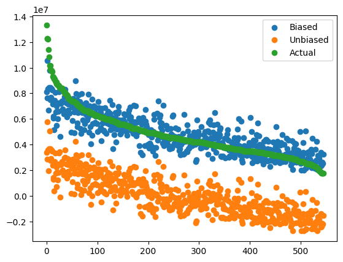

This post aims to show the impact and importance of the bias term in linear regression models. Linear regression models take the form

$$
\hat{y} = \beta_{0} + \sum_{j=1}^{p} \beta_{j} X_{j}
$$

for inputs $X_{1}, \ldots, X_{p}$ (i.e. there are $p$ features). 

I will be using the [Kaggle housing prices dataset](https://www.kaggle.com/datasets/yasserh/housing-prices-dataset/data) as a simple example, despite the collinearity of the data. We'll start by getting the data

```python
import numpy as np
import pandas as pd

data = pd.read_csv(DATA_PATH)
```

Some basic preprocessing:

```python
# Transform categorical data
data = pd.get_dummies(data, drop_first=True, dtype=int)
Y = data['price']
X = data.drop('price', axis=1)

# Standardize
from sklearn.preprocessing import StandardScaler
scaler = StandardScaler()
X = pd.DataFrame(scaler.fit_transform(X), columns=X.columns)
```

And then we add the bias term to $X$

```python
X['bias'] = 1
X, Y = X.to_numpy(), Y.to_numpy()
```

Now we will compute the coefficients $\beta$ analytically using the Normal Equation

$$
\beta = (X^{T}X)^{-1} X^{T} y
$$

and then use the coefficient vector to calculate $\hat{y}$ and the mean squared error

```python
beta = np.linalg.inv(X.T.dot(X)).dot(X.T).dot(Y)
Yhat = X.dot(beta)
mse = np.mean((Yhat - Y) ** 2)
```

Now, we will see what happens when we follow the same procedure but without adding the bias term. All other steps remain the same.

| Coefficient    | With bias        | Without bias     |
|----------------|------------------|------------------|
| Area           | 529330.60363747  | 529330.60363747  |
| Bedrooms       | 84642.78885355   | 84642.78885355   |
| Bathrooms      | 495817.70908537  | 495817.70908537  |
| Stories        | 390748.2656748   | 390748.2656748   |
| Parking        | 238532.39119855  | 238532.39119855  |
| Main road      | 146735.42974425  | 146735.42974425  |
| Guest room     | 114950.32935761  | 114950.32935761  |
| Basement       | 167040.77163767  | 167040.77163767  |
| Hot water      | 178965.10323907  | 178965.10323907  |
| A/C            | 401991.91011608  | 401991.91011608  |
| Preferred area | 276197.74367233  | 276197.74367233  |
| Semi-furnished | -22847.00683726  | -22847.00683726  |
| Unfurnished    | -192857.24250658 | -192857.24250658 |
| Bias           | 4766729.24770643 | *N/A*            |

And we can see the significant improvement in the mean squared error:

|                    | With bias          | Without bias       |
|--------------------|--------------------|--------------------|
| Mean squared error | 1111187722284.4001 | 23832895443224.234 |

A 21x improvement! The plot comparing the two is even more enlightening.



You can literally see the intercept term at work "lifting" the predictions and why it makes such a simple, yet impressive difference in the performance of the model.
